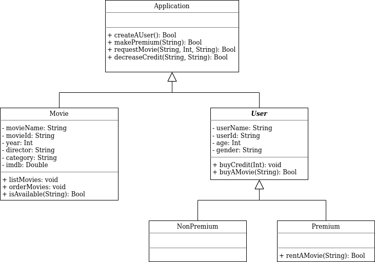

# Object Oriented Programming
Kodluyoruz OOP eğitimi ödevleri

---
### University Management System UML Diagram

---
### Zoo Management System UML Diagram

---
### Flight Management System UML Diagram

---
### Online Movie System UML Diagram

---
## Links
[www.patika.dev/koixos](https://app.patika.dev/koixos)
